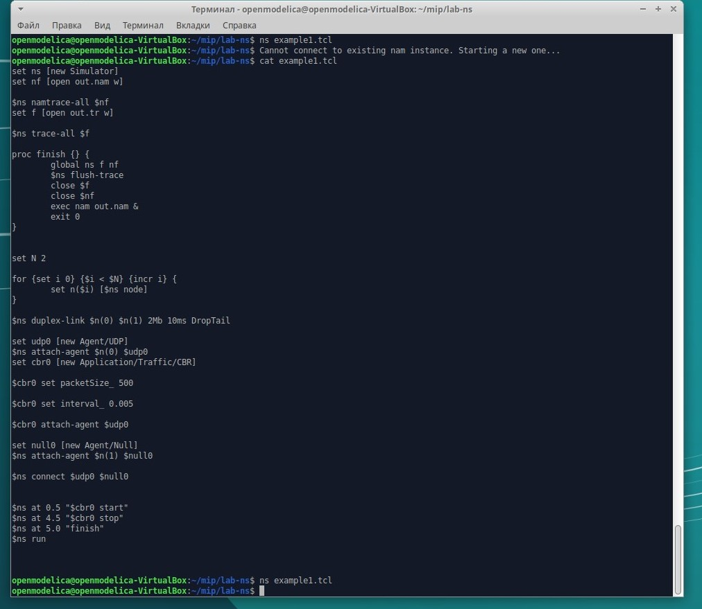
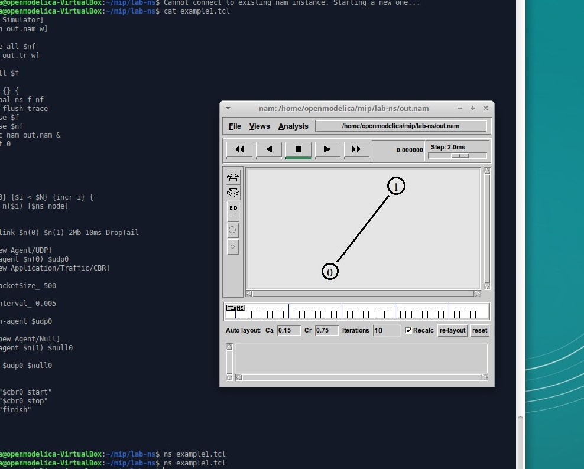

---
# Front matter
"Лабораторная работа 1. Простые модели компьютерной сети"

"Ибрагимов Улугбек Блтырхонович"

# Цель работы

Приобретение навыков моделирования сетей передачи данных с помощью сред-
ства имитационного моделирования NS-2, а также анализ полученных результатов
моделирования.

# Ход работы

1. В своем рабочем каталоге создаем директорию mip, в которой будут выполнять лабораторные работы. Внутри нее создаем директорию lab-ns, а в ней файл shablon.tcl.

2. Пишем программу в файл shablon.tcl и example1.tcl.

3. Запускаем моделирование с помощью команды nam out.nam.

# Выводы

Получены навыки моделирования сетей передачи данных в NS-2.

# Библиография

1. Методические материалы курса